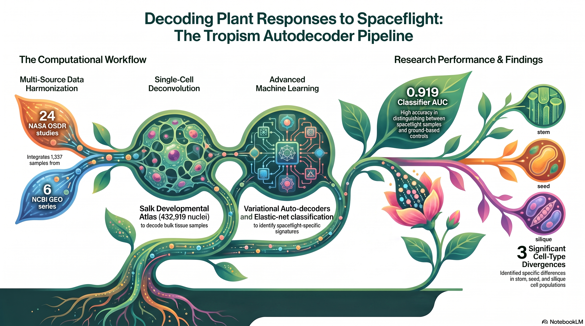

# Arabidopsis thaliana Spaceflight Tropism Recognition System

A FAIR-compliant computational pipeline for recognizing and classifying tropism responses in *Arabidopsis thaliana* under spaceflight conditions, integrating bulk transcriptomics from NASA OSDR and[...]

## Overview



This repository contains a complete end-to-end pipeline that:

1. **Ingests and harmonizes** bulk RNA-seq and microarray data from NASA GeneLab OSDR (24 studies, 1190 samples) and NCBI GEO (6 tropism-focused series, 147 samples), totaling 1337 samples across g[...]

2. **Integrates the Salk Institute Arabidopsis Developmental Atlas** (GSE226097; 432,919 nuclei, 183 clusters, 10 developmental stages) as a foundation model with a custom variational auto-decoder[...]

3. **Performs differential expression** (DESeq2) and **random-effects meta-analysis** (DerSimonian-Laird) across 11 spaceflight studies, followed by **elastic-net tropism classification** with nes[...]

4. **Visualizes results** using ggPlantMap tissue projections, KEGG pathway networks (tidygraph/ggraph), heatmaps, volcano plots, and forest plots.

## Web Tool

An interactive, browser-based companion tool lets reviewers and readers upload their own *Arabidopsis* expression matrix (`.csv`/`.txt`) and receive a publication-ready figure panel and auto-generated legend that decode four tropism signatures — gravitropism, phototropism, thigmotropism (touch), and hydrotropism. It runs entirely client-side (no server; uploaded data never leaves the browser) and is served from `docs/` via GitHub Pages.

- **Live URL** (after enabling **Settings → Pages → Deploy from branch → `main` / `/docs`**): `https://dr-richard-barker.github.io/Tropism_autodecoder_2026/`
- **Method (Phase 1)**: rank-based single-sample enrichment (singscore) against curated, literature-verified tropism marker gene sets. These are marker-enrichment scores, **not** the auto-decoder output.
- **Phase 2 (wired, artifacts pending)**: a browser NNLS deconvolution + stimulus projection + elastic-net classifier reproduces the manuscript's cell-type fractions, stimulus scores, and Flight-vs-Ground-Control probability directly in the page. It activates automatically once `Code/export_web_artifacts.py` populates `docs/assets/model/` (signature matrix, stimulus codes, classifier params) — until then the tool stays on Phase 1.

See `WEB_TOOL_PLAN.md` for the full design, accessibility spec, and roadmap (including a Phase 3 orthology network for non-*Arabidopsis* data).

## Repository Structure

```
.
├── Code/                          # Analysis scripts
│   ├── train_autodecoder.py       # Custom VAE auto-decoder training
│   ├── project_bulk.py            # Bulk deconvolution & stimulus projection
│   ├── meta_classifier.py         # Meta-analysis & tropism classifier
│   ├── run_de.R                   # DESeq2 differential expression
│   ├── visualization.R            # Main visualization suite
│   ├── viz_ggplantmap.R           # ggPlantMap tissue projections
│   ├── train_autodecoder_gpu.py   # GPU / full-atlas auto-decoder training (v1.1.0)
│   ├── export_atlas.R             # Atlas extraction for training (full or stratified subsample)
│   └── export_web_artifacts.py    # Export Phase-2 model bundle for the web tool
├── Data/                          # Harmonized input data
│   └── harmonized_metadata.tsv    # 1337 samples × 19 metadata fields
├── Results/                       # Analysis outputs
│   ├── meta_analysis_results.tsv  # 26,402 genes, random-effects meta-analysis
│   ├── cell_type_fractions_all.csv # 398 samples × 183 cell-type fractions
│   ├── stimulus_activation_all.csv # 398 samples × 32 stimulus dimensions
│   ├── flight_vs_gc_feature_importance.csv
│   ├── celltype_flight_vs_ground.csv
│   ├── de_analysis_summary.tsv
│   └── physiospace_scores_all.csv
├── Figures/                       # Publication-ready figures (SVG + PNG)
│   ├── volcano_meta_analysis.*    # Meta-analysis volcano plot
│   ├── heatmap_celltype_fractions.* # Cell-type fraction heatmap
│   ├── heatmap_stimulus_activation.* # Stimulus activation heatmap
│   ├── ggplantmap_root_projection.*  # Root tip tissue map
│   ├── ggplantmap_rosette_projection.* # Rosette tissue map
│   ├── ggplantmap_shootapex_projection.* # Shoot apex tissue map
│   ├── ggplantmap_leaf_crosssection.* # Leaf cross-section map
│   ├── ggplantmap_stem_crosssection.* # Stem cross-section map
│   ├── kegg_pathway_network.*     # KEGG pathway network
│   ├── forest_plot_top_gene.*     # Forest plot (top meta-analysis gene)
│   ├── classifier_feature_importance.* # Classifier feature importance
│   ├── organ_level_diff_barplot.* # Organ-level abundance changes
│   └── dataset_summary.*          # Dataset composition summary
├── Manuscript/                    # Scientific manuscript
│   └── manuscript.md
├── docs/                          # Interactive web tool (GitHub Pages) — see "Web Tool" above
│   ├── index.html                 # Upload-and-decode tool + landing page
│   └── assets/                    # app.js, model.js (Phase 2), style.css, signatures.js, sample_data.csv, model/
├── environment.yml                # Conda environment specification
├── environment.gpu.yml            # CUDA conda environment (full-atlas GPU training)
├── environment.mps.yml            # Apple Silicon / Metal (MPS) conda environment
├── Dockerfile                     # Containerized reproduction
├── Dockerfile.gpu                 # CUDA container (full-atlas GPU training)
├── GPU_TRAINING_PLAN.md           # Plan for full-atlas GPU retraining
├── WEB_TOOL_PLAN.md               # Plan for the interactive web tool
├── metadata.json                  # DataCite 4.x metadata
├── CHANGELOG.md                   # Version history (1.0.0 → 1.1.0)
└── README.md                      # This file
```

## Key Results

| Metric | Value |
|--------|-------|
| Total samples harmonized | 1,337 |
| OSDR studies | 24 (18 RNA-seq + 6 microarray) |
| GEO series | 6 |
| Atlas cells (foundation model) | 432,919 |
| Atlas clusters | 183 |
| Auto-decoder latent dimensions | 32 |
| Bulk samples deconvolved | 398 |
| DE studies (DESeq2) | 11 |
| Meta-analysis genes | 26,402 |
| Meta-analysis significant (padj<0.05) | 16,002 |
| Flight vs GC classifier AUC | 0.919 ± 0.047 |
| Tropism classifier F1 | 1.000 (gravitropism vs phototropism) |
| Significant cell-type differences | 3 (stem_9, seed_425d_7, silique_20) |

## Methods Summary

### Data Acquisition
- **OSDR**: Metadata via `https://visualization.osdr.nasa.gov/biodata/api/v2/query/metadata/`; count matrices via direct file download from `https://osdr.nasa.gov/geode-py/ws/studies/OSD-{id}/down[...]
- **GEO**: Series metadata via GEOquery; supplementary files via HTTPS mirror of FTP
- **Tropism labeling**: Heuristic inference from tissue type, hardware (EMCS→gravitropism, Veggie/LED→phototropism), light regime, and study-specific overrides

### Foundation Model
- **Salk Arabidopsis Developmental Atlas** (GSE226097): Seurat v5 object with 432,919 nuclei across 10 developmental stages
- **Signature matrix**: 4000 HVGs × 183 clusters, extracted from atlas RNA assay
- **Cell-type markers**: Top 50 markers per cluster (9150 total)

### Auto-decoder
- **Architecture**: Conditional VAE (encoder: 4000→512→256, latent dim 32, decoder: 32+64 condition → 512 → 512 → 4000)
- **Conditioning**: Cluster embedding (183→32), organ embedding (12→16), stage embedding (10→16)
- **Auxiliary head**: Cluster classification (cross-entropy)
- **Loss**: MSE reconstruction + 0.5×KLD + 0.1×CE
- **Training**: 40 epochs, batch 256, AdamW (lr=1e-3, cosine schedule), early stopping (patience 8), CPU
- **Best model**: Epoch 5, val_loss=0.4300, val_recon=0.140, val_kld=0.207

### Deconvolution
- **Primary**: NNLS fitting of bulk expression onto signature matrix → cell-type fractions → stimulus activation (weighted average of per-cluster stimulus codes)
- **Baseline 1**: PhysioSpace-style cosine similarity in PCA space
- **Baseline 2**: CIBERSORTx-style NNLS

### Differential Expression & Meta-analysis
- **DESeq2**: Per-study Flight vs Ground Control, apeglm LFC shrinkage
- **Meta-analysis**: DerSimonian-Laird random-effects on log2FC_shrunk, BH correction

### Classification
- **Flight vs GC**: Elastic-net logistic regression, nested 5-fold CV, AUC=0.919
- **Tropism type**: Multinomial elastic-net, F1=1.0 (gravitropism vs phototropism)

### Visualization
- **ggPlantMap**: Tissue-level projection of cell-type abundance changes onto Arabidopsis anatomy maps (root tip, rosette, shoot apex, leaf, stem)
- **KEGG pathway network**: tidygraph/ggraph network of pathways sharing DE genes
- **Standard plots**: Volcano, heatmap, forest, bar plot, feature importance

## Limitations

1. **Auto-decoder training scale**: The v1.0.0 auto-decoder was trained on CPU with a 60,792-cell stratified subsample (all 183 clusters); the full 432k atlas was already used for the signature matrix and deconvolution. The full-atlas GPU retrain has since been **completed** (2026-07): rebuilt entirely from the public atlas (GSE226097 `global_integration_221009.rds`), the auto-decoder was retrained on all **432,919 nuclei** via `Code/export_atlas.R` → `Code/train_autodecoder_gpu.py` (Apple MPS, ~3.4 min), improving validation loss to **0.3739** (vs 0.4300 for the 60k draft; reconstruction ≈ unchanged). The **Flight-vs-Ground-Control classifier has since been regenerated** on the retrained atlas: the bulk OSDR RNA-seq counts (14 studies) were re-acquired directly from OSDR, re-run through DESeq2 → NNLS deconvolution → elastic-net classifier, reproducing **AUC 0.915 ± 0.043** (vs 0.919 for v1.0.0) on 124 matched Flight/GC samples. These retrained artifacts power the web tool's **Phase 2** (`docs/assets/model/`). Remaining v1.0.0 caveat: the static `Results/` tables and published figures in this release have not been re-rendered, and GEO/microarray studies were not part of the classifier re-fit. Large retrain artifacts (embeddings, checkpoint, `expr_sub.bin`) are archived separately (Zenodo), not in git.
2. **OSDR API timeouts**: Large studies (OSD-37, OSD-38, OSD-480) time out on `/v2/query/data/` endpoint; count matrices obtained via direct file download
3. **Tropism data asymmetry**: Gravitropism/phototropism well-covered; hydrotropism (6 samples), mechanotropism (12 samples); chemotropism/oxytropism have no dedicated Arabidopsis transcriptomics[...]
4. **Metadata matching**: 124/398 deconvolved samples matched to tropism labels via GSM IDs (OSDR sample naming convention varies)
5. **ggkegg/SBGNview unavailable**: Rgraphviz system dependency failed; KEGG pathway network rendered with tidygraph/ggraph + org.At.tair.db annotations instead
6. **Tropism classifier**: Perfect F1=1.0 for gravitropism vs phototropism reflects tissue/hardware confounding rather than subtle tropism-specific signatures; the Flight vs GC classifier (AUC=0.[...]

## Reproduction

### Environment
```bash
conda env create -f environment.yml
conda activate arabidopsis-tropism
```

### Docker
```bash
docker build -t arabidopsis-tropism .
docker run -v $(pwd)/Data:/data arabidopsis-tropism
```

### Pipeline
1. Data acquisition: Download OSDR + GEO data (see Code/ for API endpoints)
2. Atlas preprocessing: Load GSE226097, extract signatures and HVG expression
3. Auto-decoder: `python Code/train_autodecoder.py`
4. DE: `Rscript Code/run_de.R`
5. Projection: `python Code/project_bulk.py`
6. Meta-analysis & classifier: `python Code/meta_classifier.py`
7. Visualization: `Rscript Code/visualization.R && Rscript Code/viz_ggplantmap.R`

## Data Sources

- **NASA GeneLab OSDR**: https://osdr.nasa.gov/biodata/api/v2/query/
- **NCBI GEO**: https://www.ncbi.nlm.nih.gov/geo/
- **Salk Atlas**: GSE226097 (https://www.ncbi.nlm.nih.gov/geo/query/acc.cgi?acc=GSE226097)

## License

CC BY 4.0 — Creative Commons Attribution 4.0 International

## Citation

See metadata.json for DataCite metadata. Please cite the original data sources (OSDR, GEO, Salk Atlas) when using this pipeline.
